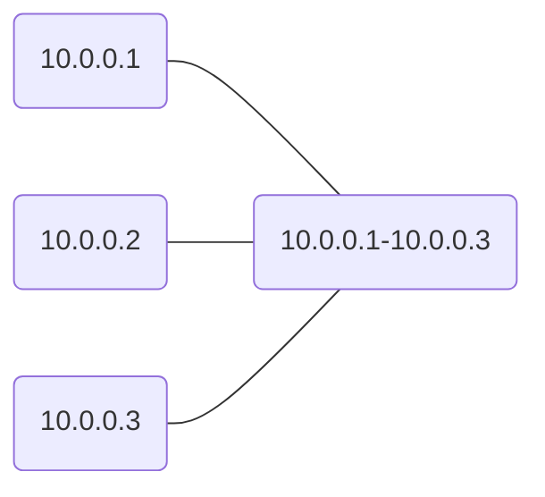

# Arrange IPs!
A simple script to group IP addresses into their range. 

### Eg:
```
    10.0.0.1, 10.10.0.2, 10.0.0.3 becomes 10.0.0.1-10.0.0.3
```

### Usage
```
    python Arrange.py -i ip.txt
```
